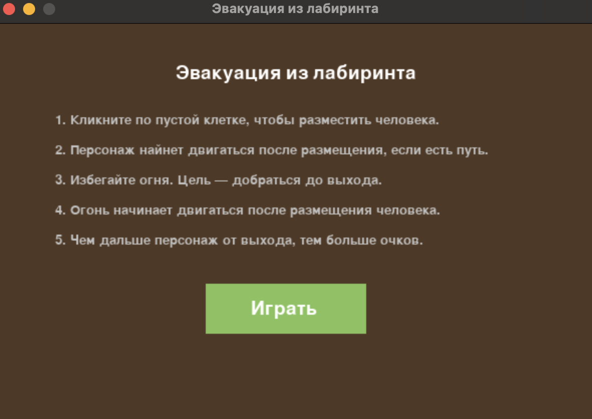
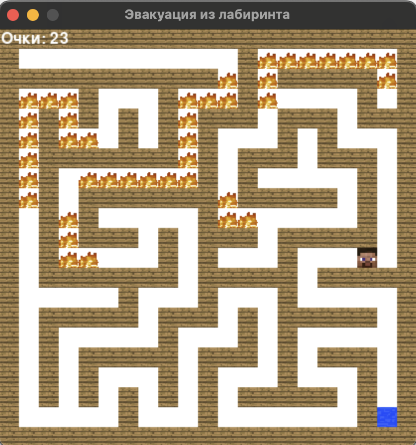
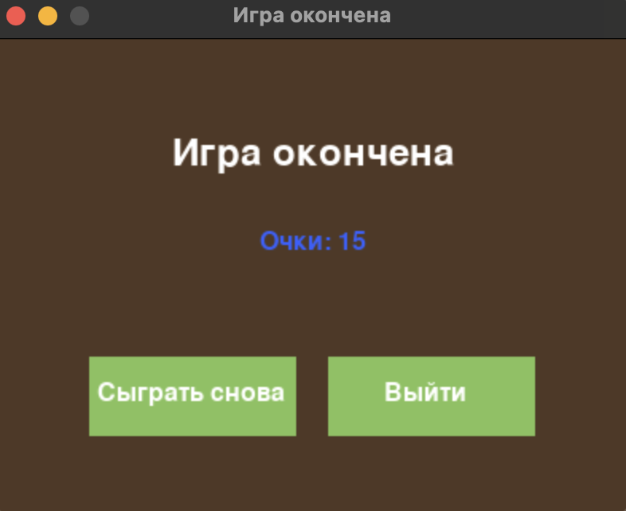

# FIRE_GRAPH
# Доступ к summary презентации осуществляется по ссылке
```bash
https://disk.yandex.ru/i/CPTbYLt6VuAxCw
```
# Эвакуация из лабиринта

Интерактивная игра на Pygame, в которой игрок должен помочь персонажу выбраться из лабиринта,
избегая огня. Лабиринт генерируется автоматически, а огонь начинает распространяться после
установки персонажа.

## Скриншоты




# Особенности
- Генерация лабиринта с помощью алгоритма на основе DFS.
- Реалистичное распространение огня.
- Простая навигация с использованием алгоритма поиска пути.
- Графика с изображениями и фоновая музыка.
- Экран правил и экран окончания игры с возможностью переиграть.

# Используемые элементы
- Человек — игрок, которого вы размещаете на карте.
- Выход — цель игрока.
- Огонь — распространяется с вероятностью 6% на соседние пустые клетки.
- Стены — непроходимые препятствия.
- Пустота — свободные клетки для движения.

# Управление
- Мышь: Клик по пустой клетке для размещения персонажа.
- Закрытие окна или кнопки на экране: Выход из игры.

# Правила игры
- Кликните по пустой клетке, чтобы разместить персонажа.
- Персонаж начинает двигаться автоматически(если персонаж не начал двигаться, значит, пути к выходу нет)
- Огонь начнет распространяться после размещения человека.
- Избегайте огня и доберитесь до выхода.
- Чем дальше путь до выхода — тем больше очков.

# Установка и запуск

## Требования
- Python 3.8 или выше
- Pygame 2.0.0 или выше

## Пошаговая инструкция

1. Склонируйте репозиторий:
```bash
git clone https://github.com/your-username/FIRE_GRAPH.git
cd FIRE_GRAPH
```

2. Создайте и активируйте виртуальное окружение:
```bash
python -m venv venv
source venv/bin/activate  
```

3. Установите зависимости:
```bash
pip install numpy pygame
```

4. Убедитесь, что у вас есть все необходимые ресурсы в папке `assets`:
- `photo1.png` — изображение персонажа
- `photo2.png` — изображение выхода
- `photo3.png` — изображение огня
- `photo4.png` — изображение стены
- `photo5.png` — фоновое изображение
- `music.mp3` — музыкальный файл для фона

5. Запустите игру:
```bash
python main.py
```


# Алгоритмы
- Генерация лабиринта — использует DFS для создания проходов. Алгоритм Эллера 
- Поиск пути — алгоритм BFS (поиск в ширину).
- Огонь — распространяется случайным образом на соседние клетки.
